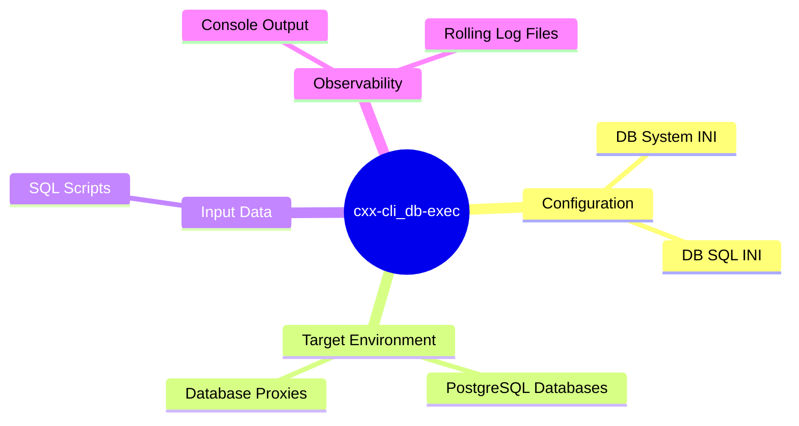
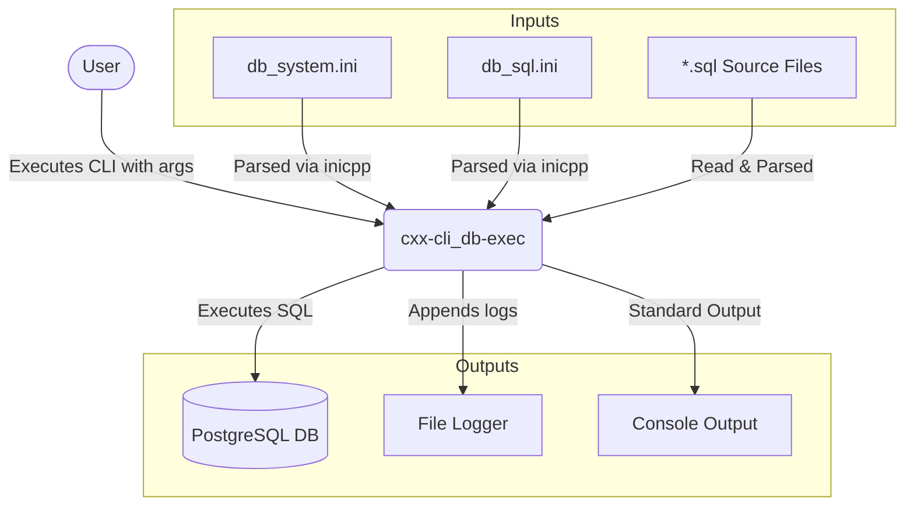

# 01 Overview Diagram

This document provides a high-level overview of the `cxx-cli_db-exec` architecture, detailing its context boundary and external interfaces.

## Bounded Context Diagram

The bounded context diagram shows the CLI application in relation to external actors, such as the user, configuration files, and the target databases.

## Interfaces Diagram

The interfaces diagram illustrates the primary inputs and outputs of the tool.

