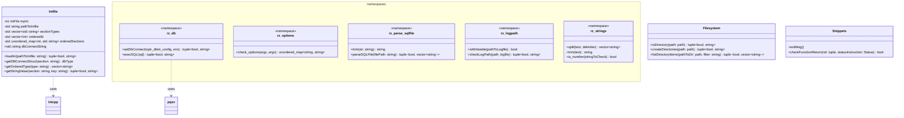

# 02 Class Diagram

This diagram outlines the major classes and namespaces within the `cxx-cli_db-exec` codebase and their relationships.

```mermaid
classDiagram
    class Inifile {
        -ini::IniFile myIni
        -std::string pathToInifile
        -std::vector~std::string~ sectionTypes
        -std::vector~int~ orderedId
        -std::unordered_map~int, std::string~ orderedSections
        +std::string dbConnectString
        +loadIni(pathToInifile: string) tuple~bool, string~
        +getDBConnectStruct(section: string) dbType
        +getOrderedType(type: string) vector~string~
        +getStringValue(section: string, key: string) tuple~bool, string~
    }

    class Filesystem {
        +isDirectory(path: path) tuple~bool, string~
        +createDirectories(path: path) tuple~bool, string~
        +listDirectoryItems(pathToDir: path, filter: string) tuple~bool, vector~string~~
    }

    class Snippets {
        +exitMsg()
        +checkFunctionReturn(ret: tuple, statusInstruction: Status) bool
    }

    namespace namespaces {
        class rz_db {
            <<namespace>>
            +setDbConnect(sptr_dbini_config, env) tuple~bool, string~
            +execSQL(sql) tuple~bool, string~
        }
    
        class rz_options {
            <<namespace>>
            +check_options(argc, argv) unordered_map~string, string~
        }
    
        class rz_parse_sqlfile {
            <<namespace>>
            +trim(str: string) string
            +parseSQLFile(filePath: string) tuple~bool, vector~string~~
        }
    
        class rz_logpath {
            <<namespace>>
            +isWriteable(pathToLogfile) bool
            +checkLogPath(path, logfile) tuple~bool, string~
        }
        
        class rz_strings {
            <<namespace>>
            +split(text, delimiter) vector~string~
            +trim(text) string
            +is_number(stringToCheck) bool
        }
    }

    Inifile ..> inicpp : uses
    rz_db ..> pqxx : uses
```
