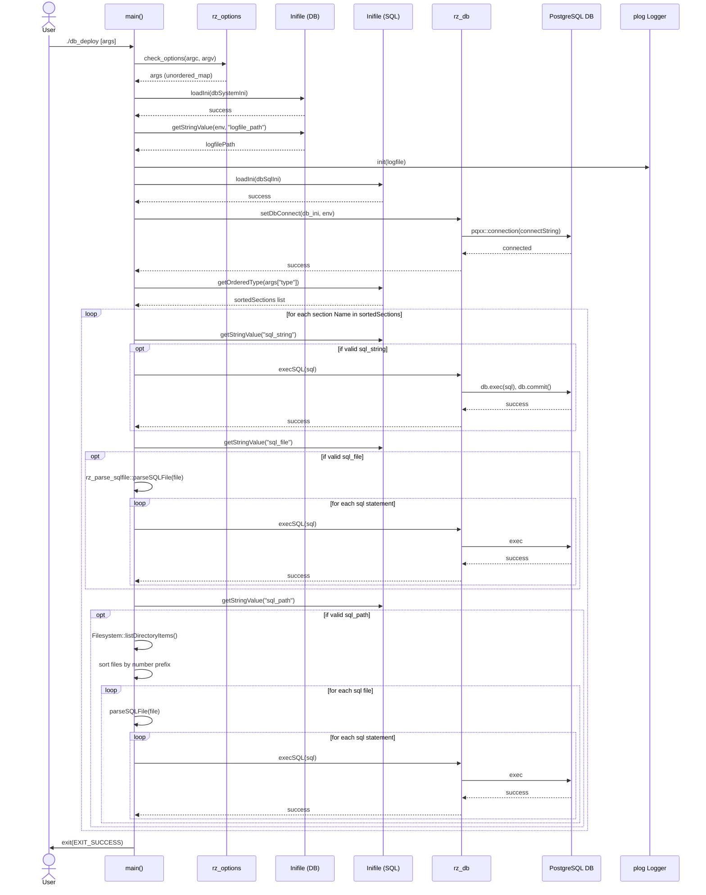

<!-- START doctoc generated TOC please keep comment here to allow auto update -->
<!-- DON'T EDIT THIS SECTION, INSTEAD RE-RUN doctoc TO UPDATE -->
**Table of Contents**

- [03 Sequence Diagram](#03-sequence-diagram)

<!-- END doctoc generated TOC please keep comment here to allow auto update -->

# 03 Sequence Diagram

This sequence diagram illustrates the lifecycle of the application execution, triggered from standard user invocation.

