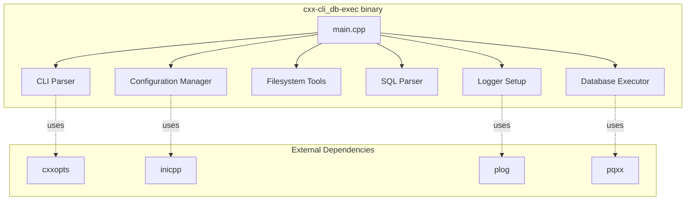

# 04 Component Diagram

The component diagram details the physical packaging structure and sub-systems within the program.

```mermaid
flowchart TD
    subgraph App ["cxx-cli_db-exec binary"]
        options["CLI Parser"]
        config["Configuration Manager"]
        fs["Filesystem Tools"]
        sqlparse["SQL Parser"]
        dbexec["Database Executor"]
        logger["Logger Setup"]
        main["main.cpp"]
    end

    subgraph Ext ["External Dependencies"]
        cxxopts["cxxopts"]
        inicpp["inicpp"]
        plog["plog"]
        pqxx["pqxx"]
    end

    options -. "uses" .-> cxxopts
    config -. "uses" .-> inicpp
    logger -. "uses" .-> plog
    dbexec -. "uses" .-> pqxx

    main --> options
    main --> config
    main --> fs
    main --> sqlparse
    main --> dbexec
    main --> logger
```
