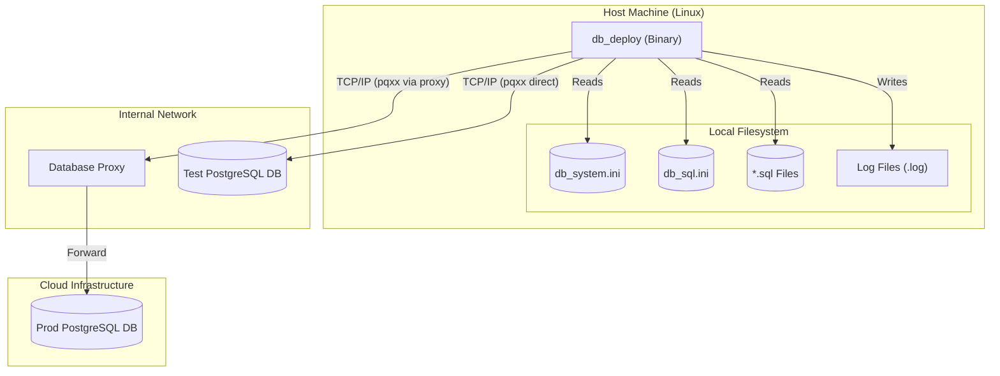

<!-- START doctoc generated TOC please keep comment here to allow auto update -->
<!-- DON'T EDIT THIS SECTION, INSTEAD RE-RUN doctoc TO UPDATE -->
**Table of Contents**

- [05 Deployment Diagram](#05-deployment-diagram)

<!-- END doctoc generated TOC please keep comment here to allow auto update -->

# 05 Deployment Diagram

The deployment diagram illustrates the CLI tool on its host system and how it interfaces with external infrastructure.

