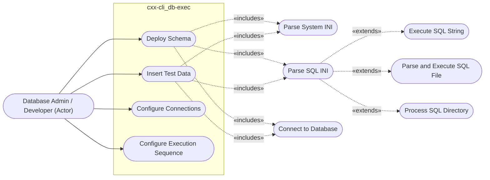

# 06 Use Case Diagram

The use case diagram depicts the user interactions and objectives when utilizing the `cxx-cli_db-exec` tool.

```mermaid
flowchart LR
    User(["Database Admin / Developer (Actor)"])

    subgraph db_exec ["cxx-cli_db-exec"]
        UC1(["Deploy Schema"])
        UC2(["Insert Test Data"])
        UC3(["Configure Connections"])
        UC4(["Configure Execution Sequence"])
    end

    User --> UC1
    User --> UC2
    User --> UC3
    User --> UC4

    SysIni(["Parse System INI"])
    SqlIni(["Parse SQL INI"])
    Connect(["Connect to Database"])
    ExecStr(["Execute SQL String"])
    ExecFile(["Parse and Execute SQL File"])
    ExecDir(["Process SQL Directory"])

    UC1 -. "«includes»" .-> SysIni
    UC1 -. "«includes»" .-> SqlIni
    UC1 -. "«includes»" .-> Connect

    UC2 -. "«includes»" .-> SysIni
    UC2 -. "«includes»" .-> SqlIni
    UC2 -. "«includes»" .-> Connect

    SqlIni -. "«extends»" .-> ExecStr
    SqlIni -. "«extends»" .-> ExecFile
    SqlIni -. "«extends»" .-> ExecDir
```
