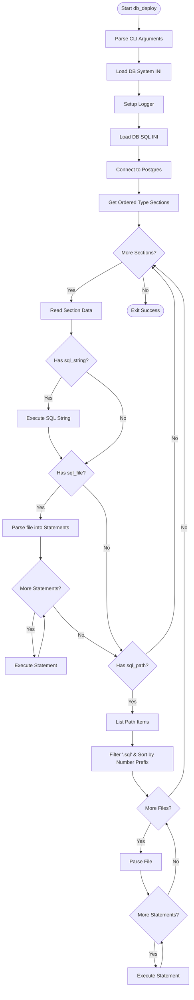

# 07 Activity Diagram

The activity diagram shows the programmatic control flow based on the execution attributes within each active SQL INI section.

```mermaid
flowchart TD
    Start([Start db_deploy]) --> ParseArgs[Parse CLI Arguments]
    ParseArgs --> LoadSysIni[Load DB System INI]
    LoadSysIni --> SetupLog[Setup Logger]
    SetupLog --> LoadSqlIni[Load DB SQL INI]
    LoadSqlIni --> ConnectDB[Connect to Postgres]
    ConnectDB --> GetSections[Get Ordered Type Sections]
    
    GetSections --> LoopStart{More Sections?}
    LoopStart -- Yes --> ReadSection[Read Section Data]
    
    ReadSection --> CheckSqlString{Has sql_string?}
    CheckSqlString -- Yes --> ExecSqlString[Execute SQL String]
    ExecSqlString --> CheckSqlFile
    CheckSqlString -- No --> CheckSqlFile
    
    CheckSqlFile{Has sql_file?}
    CheckSqlFile -- Yes --> ParseFile[Parse file into Statements]
    ParseFile --> LoopStatements1{More Statements?}
    LoopStatements1 -- Yes --> ExecStatement1[Execute Statement]
    ExecStatement1 --> LoopStatements1
    LoopStatements1 -- No --> CheckSqlPath
    CheckSqlFile -- No --> CheckSqlPath
    
    CheckSqlPath{Has sql_path?}
    CheckSqlPath -- Yes --> ListDir[List Path Items]
    ListDir --> FilterAndSort[Filter '.sql' & Sort by Number Prefix]
    FilterAndSort --> LoopFiles{More Files?}
    LoopFiles -- Yes --> ParseFileDir[Parse File]
    ParseFileDir --> LoopStatements2{More Statements?}
    LoopStatements2 -- Yes --> ExecStatement2[Execute Statement]
    ExecStatement2 --> LoopStatements2
    LoopStatements2 -- No --> LoopFiles
    LoopFiles -- No --> LoopStart
    CheckSqlPath -- No --> LoopStart
    
    LoopStart -- No --> Stop([Exit Success])
```
