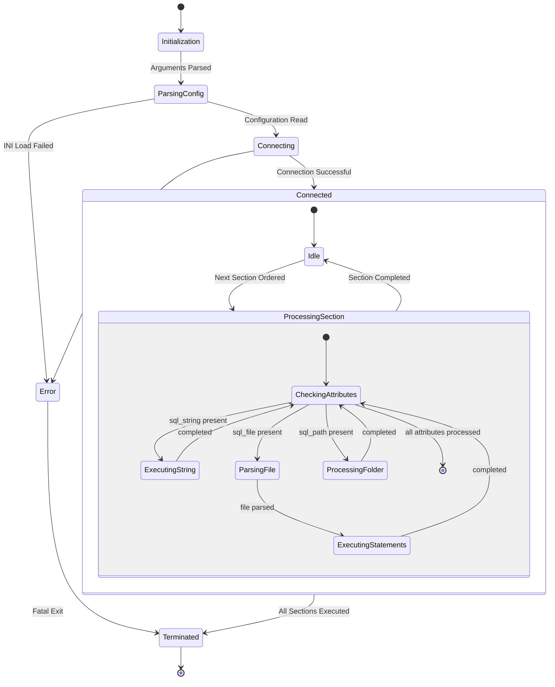

# 08 State Machine Diagram

This state machine diagram captures the connection lifecycle and operational states during the application execution.

```mermaid
stateDiagram-v2
    [*] --> Initialization
    
    Initialization --> ParsingConfig : Arguments Parsed
    ParsingConfig --> Error : INI Load Failed
    ParsingConfig --> Connecting : Configuration Read
    
    Connecting --> Error : Connection Failed
    Connecting --> Connected : Connection Successful
    
    state Connected {
        [*] --> Idle
        Idle --> ProcessingSection : Next Section Ordered
        
        state ProcessingSection {
            [*] --> CheckingAttributes
            CheckingAttributes --> ExecutingString : sql_string present
            ExecutingString --> CheckingAttributes : completed
            CheckingAttributes --> ParsingFile : sql_file present
            ParsingFile --> ExecutingStatements : file parsed
            ExecutingStatements --> CheckingAttributes : completed
            CheckingAttributes --> ProcessingFolder : sql_path present
            ProcessingFolder --> CheckingAttributes : completed
            CheckingAttributes --> [*] : all attributes processed
        }
        
        ProcessingSection --> Idle : Section Completed
    }
    
    Connected --> Terminated : All Sections Executed
    Error --> Terminated : Fatal Exit
    Terminated --> [*]
```
