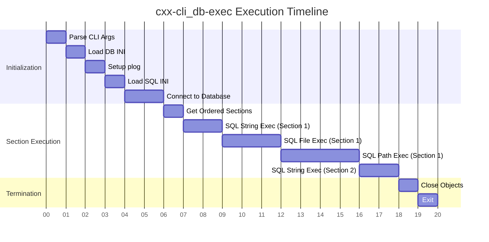

# 09 Timing Diagram

The timing diagram conceptually represents the active execution state of critical system components across the application runtime.

```mermaid
gantt
    title cxx-cli_db-exec Execution Timeline
    dateFormat  s
    axisFormat  %S
    
    section Initialization
    Parse CLI Args             :a1, 0, 1s
    Load DB INI                :a2, after a1, 1s
    Setup plog                 :a3, after a2, 1s
    Load SQL INI               :a4, after a3, 1s
    Connect to Database        :a5, after a4, 2s
    
    section Section Execution
    Get Ordered Sections       :b1, after a5, 1s
    SQL String Exec (Section 1):b2, after b1, 2s
    SQL File Exec (Section 1)  :b3, after b2, 3s
    SQL Path Exec (Section 1)  :b4, after b3, 4s
    SQL String Exec (Section 2):b5, after b4, 2s
    
    section Termination
    Close Objects              :c1, after b5, 1s
    Exit                       :c2, after c1, 1s
```
