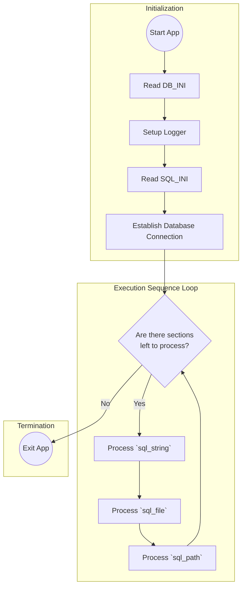

<!-- START doctoc generated TOC please keep comment here to allow auto update -->
<!-- DON'T EDIT THIS SECTION, INSTEAD RE-RUN doctoc TO UPDATE -->
**Table of Contents**

- [10 Interaction Overview Diagram](#10-interaction-overview-diagram)

<!-- END doctoc generated TOC please keep comment here to allow auto update -->

# 10 Interaction Overview Diagram

The interaction overview diagram brings the focus to the control flow between various interactions or participants inside the application architecture.

