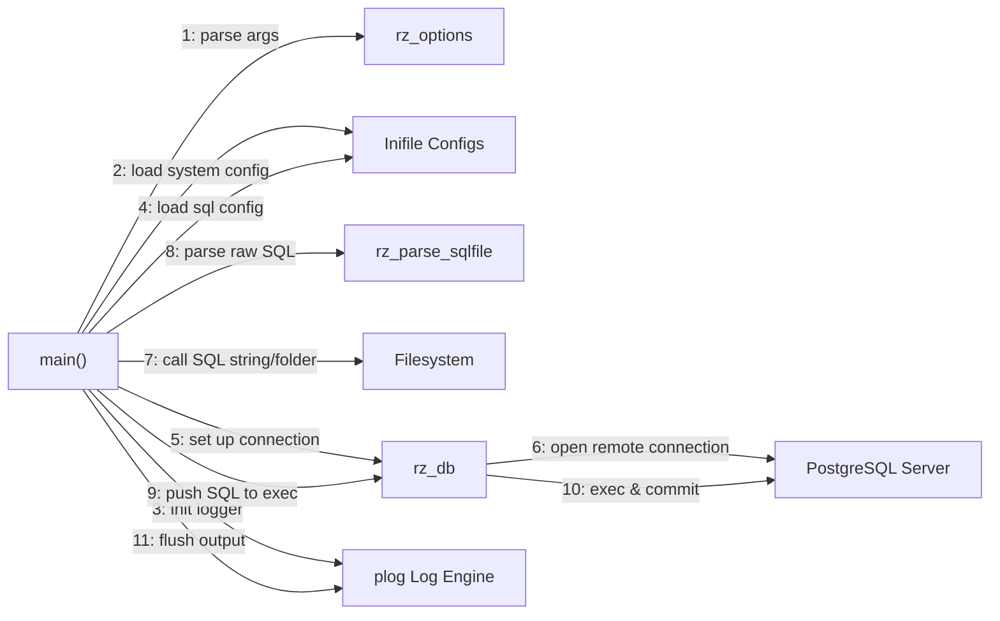

<!-- START doctoc generated TOC please keep comment here to allow auto update -->
<!-- DON'T EDIT THIS SECTION, INSTEAD RE-RUN doctoc TO UPDATE -->
**Table of Contents**

- [11 Communication Diagram](#11-communication-diagram)

<!-- END doctoc generated TOC please keep comment here to allow auto update -->

# 11 Communication Diagram

This diagram displays how independent modules pass messages and coordinate in order to achieve the SQL execution lifecycle. In Mermaid JS, a `flowchart` is used to represent the communication patterns.

