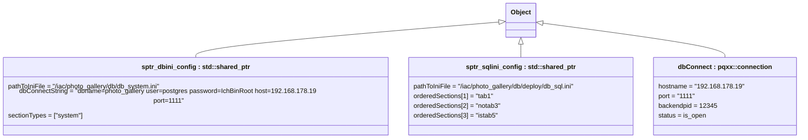

<!-- START doctoc generated TOC please keep comment here to allow auto update -->
<!-- DON'T EDIT THIS SECTION, INSTEAD RE-RUN doctoc TO UPDATE -->
**Table of Contents**

- [12 Object Diagram](#12-object-diagram)

<!-- END doctoc generated TOC please keep comment here to allow auto update -->

# 12 Object Diagram

The object diagram visualizes a distinct snapshot in time of the configuration instances required for execution.

