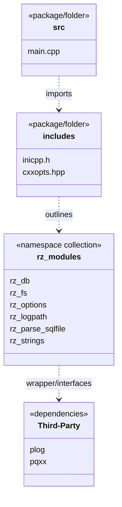

<!-- START doctoc generated TOC please keep comment here to allow auto update -->
<!-- DON'T EDIT THIS SECTION, INSTEAD RE-RUN doctoc TO UPDATE -->
**Table of Contents**

- [13 Package Diagram](#13-package-diagram)

<!-- END doctoc generated TOC please keep comment here to allow auto update -->

# 13 Package Diagram

This diagram displays the namespaces and package layout conceptually modeled around the `cxx-cli_db-exec` repository structure.

