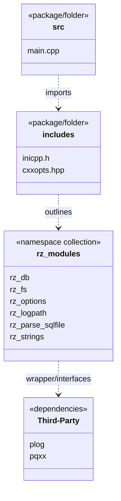

# 13 Package Diagram

This diagram displays the namespaces and package layout conceptually modeled around the `cxx-cli_db-exec` repository structure.

```mermaid
classDiagram
    class `src` {
        <<package/folder>>
        main.cpp
    }

    class `includes` {
        <<package/folder>>
        inicpp.h
        cxxopts.hpp
    }

    class `rz_modules` {
        <<namespace collection>>
        rz_db
        rz_fs
        rz_options
        rz_logpath
        rz_parse_sqlfile
        rz_strings
    }

    class `Third-Party` {
        <<dependencies>>
        plog
        pqxx
    }

    `src` ..> `includes` : imports
    `includes` ..> `rz_modules` : outlines
    `rz_modules` ..> `Third-Party` : wrapper/interfaces
```
