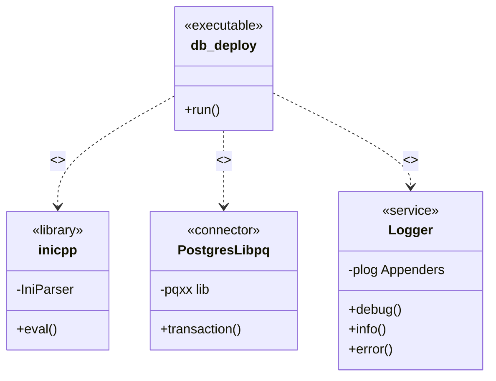

# 14 Profile Diagram

The profile diagram showcases custom stereotypes or specialized extensions applied to standard elements representing the codebase structure.

```mermaid
classDiagram
    class db_deploy {
        <<executable>>
        +run()
    }

    class inicpp {
        <<library>>
        -IniParser
        +eval()
    }

    class Logger {
        <<service>>
        -plog Appenders
        +debug()
        +info()
        +error()
    }

    class PostgresLibpq {
        <<connector>>
        -pqxx lib
        +transaction()
    }

    db_deploy ..> inicpp : <<uses>>
    db_deploy ..> PostgresLibpq : <<uses>>
    db_deploy ..> Logger : <<uses>>
```
